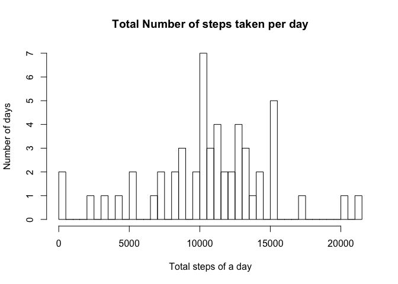
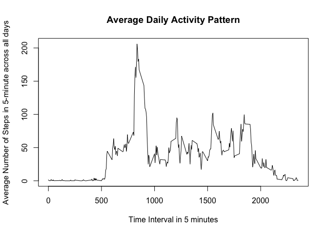
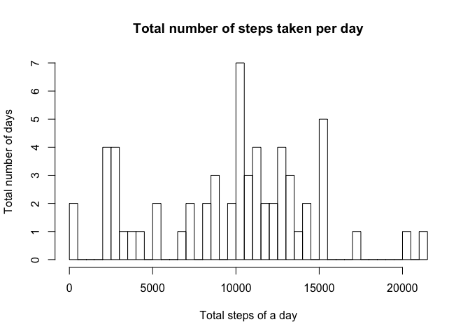
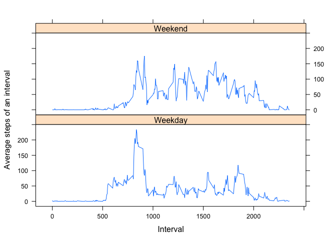

# Reproducible Research: Peer Assessment 1


## Loading and preprocessing the data
Unzip the "activity.zip" file first. Read it then and assign to "activity" data frame. Convert the date column to "date" data type.

```r
unzip("./activity.zip")
activity <- read.csv("./activity.csv", stringsAsFactors = F)
activity$date <- as.Date(activity$date, format = "%Y-%m-%d")
activity$interval <- sprintf("%04d", activity$interval)
```

## What is mean total number of steps taken per day?
Aggregate the data frame by date and apply functino of sum. A new data frame "actDay" is created.

```r
actDay <- aggregate(steps ~ date, data = activity, FUN = sum, na.action = na.omit)
```
Plot the histogram of total steps taken per day.

```r
hist(actDay$steps, breaks = nrow(actDay), xlab = "Total steps of a day", 
     ylab = "Number of days", main = "Total Number of steps taken per day")
```

 

The mean and median of the total number of steps taken per day as show by the code and results below.

```r
print(meanNum <- mean(actDay$steps))
```

```
## [1] 10766.19
```

```r
print(medianNum <- median(actDay$steps))
```

```
## [1] 10765
```

## What is the average daily activity pattern?
Aggregate the data frame by interval and apply function of mean. A new data frame "actInv" is created.

```r
actInv <- aggregate(steps ~ interval, data = activity, FUN = mean, na.action = na.omit)
```
Make a time series plot of the 5-minute interval and the average number of steps teake across all days.

```r
plot(actInv$interval, actInv$steps, type = "l", xlab = "Time Interval in 5 minutes",
     ylab = "Average Number of Steps in 5-minute across all days", main = "Average Daily Activity Pattern")
```

 
The 5-minute interval contains the maximum number of steps shown by the code and result below. "0835" in the output means the time interval  from "08:35" to "08:40"

```r
print(actInv[which(actInv$steps == max(actInv$steps)), "interval"])
```

```
## [1] "0835"
```


## Inputing missing values
The number of missing values in the dataset can be calculated by using "complete.cases" function. There are 2304 missing values.

```r
comCases <- complete.cases(activity)
numNA <- nrow(activity) - sum(comCases)
print(numNA)
```

```
## [1] 2304
```
Considering people usually have difference activity patterns in weekdays and weekends, and extreme values in a sample alway contriute a lot to the mean value of the sample. I use the median value of the interval of that specific day to fill in the missing values. In particular, a missing value on Monday for interval 08:00 to 08:05 will be filled by the median value of steps for 08:00 to 08:05 of all Mondays.
A "day" column is appeneded to the exsiting "activity" data frame. I create an "actInv2" data frame by aggregating the steps by interval and day, function applied is median. Then based on the strategy explained in previous paragraph I find the steps of a specific interval and day to replace the missing value.

```r
activity2 <- activity
activity2$day <- weekdays(activity2$date)
actInv2 <- aggregate(steps ~ interval + day, data = activity2, FUN = median)
inComAct <- activity2[!comCases, ]
for(i in 1:numNA) {
        inComAct$steps[i] <- actInv2[which(actInv2$interval == inComAct$interval[i] &
                                        actInv2$day == inComAct$day[i]), "steps"]
}
activity2[!comCases, "steps"] <- inComAct$steps
```
The data frame "actDay2" is created by aggregating the steps by column day. Histograms of the total number of steps taken each days shown as below.

```r
actDay2 <- aggregate(steps ~ date, data = activity2, FUN = sum)
hist(actDay2$steps, breaks = nrow(actDay2), xlab = "Total steps of a day",
     ylab = "Total number of days", main = "Total number of steps taken per day")
```

 
The mean and median of the total number of steps taken per day as show by the code and results below.

```r
print(meanNum <- mean(actDay2$steps))
```

```
## [1] 9705.238
```

```r
print(medianNum <- median(actDay2$steps))
```

```
## [1] 10395
```
The mean and median values both differ from the previous part of the assignment because of the filled in values. In particular, both decreased in this case.
## Are there differences in activity patterns between weekdays and weekends?

```r
activity$daytype <- weekdays(activity$date)
activity$daytype <- gsub("Monday", "Weekday", activity$daytype, ignore.case = TRUE)
activity$daytype <- gsub("Tuesday", "Weekday", activity$daytype, ignore.case = TRUE)
activity$daytype <- gsub("Wednesday", "Weekday", activity$daytype, ignore.case = TRUE)
activity$daytype <- gsub("Thursday", "Weekday", activity$daytype, ignore.case = TRUE)
activity$daytype <- gsub("Friday", "Weekday", activity$daytype, ignore.case = TRUE)
activity$daytype <- gsub("Saturday", "Weekend", activity$daytype, ignore.case = TRUE)
activity$daytype <- gsub("Sunday", "Weekend", activity$daytype, ignore.case = TRUE)
activity$daytype <- as.factor(activity$daytype)

library(lattice)
actInv3 <- aggregate(steps ~ interval + daytype, data = activity, FUN = mean)
actInv3$interval <- as.numeric(actInv3$interval)
xyplot(steps ~ interval | daytype, data = actInv3, layout = c(1,2), type = "l",
       xlab = "Interval", ylab = "Average steps of an interval")
```

 

Below differences can be observered.

1. In the early morning 0500 to 0900, weekday has bigger step number. It's mainly due to people need to prepare and go to work or school.
2. For the rest of day, weekend usually has bigger step number. I guess it's because people need to move around which this is not necessary while at work or school.
